# AI Marketplace Integration Architecture
**ShramSetu: Decoupled Real-Time Matching & Historical Planning**

---

## 1. System Separation & Decoupling Principles

ShramSetu integrates two complementary, strictly decoupled AI and analytical research systems:

1. **FairMatch (`fairmatch_v1`)**:
   - **Domain**: Real-time operational customer marketplace.
   - **Trigger**: Inbound customer service request (Trade, Location, Time slot).
   - **Function**: Multi-factor objective scoring, deterministic tie-breaking, and transparent worker ranking.
   - **Outputs**: Ordered list of eligible artisans with human-readable explanation tags.
   - **Privacy Boundary**: Aggregates worker workload server-side via `SECURITY DEFINER` RPC `fairmatch_recommend_workers` to protect worker privacy under Supabase RLS. Normal customers never see competitors' workload counts or raw mathematical factor weights.

2. **Demand Forecasting (`demand_forecast_v1`)**:
   - **Domain**: Administrative and cooperative capacity planning.
   - **Trigger**: Scheduled background process or explicit administrator console view.
   - **Function**: Time-series historical aggregation and statistical forecasting (Holt-Winters Additive Exponential Smoothing, Moving Average, Naive baselines).
   - **Outputs**: Projected daily booking volume (7-day and 14-day horizons) and advisory supply-demand gap analysis (`deficit`, `balanced`, `surplus`, `insufficientData`).
   - **Privacy Boundary**: Operates strictly on aggregate booking counts (date, service, zone); zero access by regular consumers or artisans.

```mermaid
flowchart TD
    subgraph Operational Marketplace Flow ["Operational Customer Marketplace Flow (Real-Time)"]
        Customer["Customer in App"] --> SelectService["Select Trade & Location"]
        SelectService --> DiscoveryReq["Worker Discovery Request"]
        DiscoveryReq --> FairMatchSvc["FairMatchService (fairmatch_v1)"]
        FairMatchSvc --> HardFilter["Pre-Filter: Verified Skill & Available"]
        HardFilter --> ScoreFormula["Multi-Factor Scoring:\n35% Skill, 20% Dist, 15% Avail,\n10% Rating, 10% Exp, 10% Fairness"]
        ScoreFormula --> TieBreaker["Deterministic Tie-Breaking\n(Score -> Skill -> Distance -> Worker ID)"]
        TieBreaker --> RankedResults["Worker Discovery Screen\n('FairMatch Recommended' + 'Why?' Bottom Sheet)"]
        RankedResults --> ProfileScreen["Worker Profile Screen"]
        ProfileScreen --> CreateBooking["Create Booking (Date/Time/Slot)"]
        CreateBooking --> EscrowPayment["Payment & Escrow Lock (Razorpay)"]
        EscrowPayment --> RealtimeTrack["Real-Time Tracking & Completion (OTP)"]
    end

    subgraph Administrative Planning Flow ["Administrative & Cooperative Planning Flow (Historical)"]
        BookingsTable[("Historical Bookings DB\n(Completed & InProgress)")] --> HistoricalRPC["get_historical_booking_demand RPC"]
        SyntheticDB["Isolated Pune Benchmark Dataset\n(Explicitly labelled: isSynthetic=true)"] --> HistoricalRPC
        HistoricalRPC --> ForecastSvc["DemandForecastService (demand_forecast_v1)"]
        ForecastSvc --> Baselines["Baselines: Naive (t-1), 7D MA, Seasonal Naive (t-7)"]
        ForecastSvc --> HoltWinters["Primary Model: Holt-Winters Additive\n(Level α, Trend β, 7-day Seasonality γ)"]
        HoltWinters --> ChronoEval["Chronological Out-of-Sample Evaluation\n(MAE, RMSE, Safe MAPE)"]
        HoltWinters --> SupplyGapAnalysis["Supply vs Demand Gap Analyzer\n(Ratio: Active Workers / Daily Demand)"]
        SupplyGapAnalysis --> AdminDashboard["Admin Console: Platform Analytics\n& Demand Forecast Hub"]
    end
```

---

## 2. Invariant Decoupling Rules

1. **Zero Algorithmic Cross-Contamination**:
   - Demand forecasts **never** directly manipulate FairMatch factor weights.
   - High forecasted demand does not artificially inflate individual worker scores or penalize workers.
   - FairMatch recommends individual workers for single requests; Demand Forecasting projects aggregate market volume.
2. **Customer Visibility Boundary**:
   - Customers never see demand forecast graphs, numerical volume predictions, or internal supply gap indicators.
   - Customers never see raw floating-point scores (e.g. `0.873 FairMatch score`) or factor percentages (`Fairness: 10%`).
   - Customers only see verified worker cards with subtle tags: `"FairMatch Recommended"`, `"Verified Skill • Nearby"`, and an explainable **"Why recommended?"** bottom sheet.
3. **Strict Advisory Capacity Planning**:
   - Supply gap indicators (`Potential Supply Deficit`, `Capacity Surplus`, `Balanced`) are strictly informational for human cooperative administrators.
   - The platform **never automatically**:
     - assigns workers to jobs without customer selection,
     - fires, rejects, or penalizes workers,
     - alters service prices,
     - modifies artisan diagnostic wages,
     - permanently alters worker ranking profiles.

---

## 3. Phase 0 Audit: 23 Marketplace Components

| # | Component | Production Implementation | Verification / Contract |
| :--- | :--- | :--- | :--- |
| **1** | Customer Marketplace | `CustomerHomeScreen`, `WorkerDiscoveryScreen` | Calls `DI.customerRepo.getEligibleWorkers(serviceId)`. |
| **2** | Worker Discovery | `WorkerDiscoveryScreen` | Consumes clean `List<Worker>` models with `customTag`. |
| **3** | Worker Profile | `WorkerProfileScreen` | Displays bio, rates, reviews, certifications; unaffected by AI internals. |
| **4** | Booking Flow | `BookingDateTimeScreen`, `BookingConfirmationScreen` | Explicit user selection; no automatic assignment. |
| **5** | Customer Location | `addresses` table, `LocationService`, default lat/lng | Passes coordinates to FairMatch; defaults to 2.0 km distance if missing. |
| **6** | Worker Location | `workers.latitude`, `workers.longitude`, `location_tag` | Used in Haversine distance feature scoring. |
| **7** | Service Models | `ServiceCategory`, `services` table | Filter key for candidate retrieval. |
| **8** | Worker Skills | `worker_skills` join table | Hard requirement: candidate must possess verified skill. |
| **9** | Worker Availability | `workers.is_available` boolean | Hard requirement: unavailable workers excluded before ranking. |
| **10** | Worker Verification | `workers.worker_status = 'ACTIVE'` | Hard requirement: unverified or pending workers excluded. |
| **11** | Ratings & Reviews | `reviews` table, `workers.rating`, `workers.review_count` | 10% weight in FairMatch with cold-start damping (0.5 score if new). |
| **12** | Worker Workload | Active bookings + 7-day completed bookings | Inverted fairness score: $1.0 - (W / 10.0)$; protects worker workload balance. |
| **13** | FairMatch Engine | `FairMatchEngine`, `IFairMatchRepository`, migration `013` | Multi-factor scoring ($S_{total} \in [0, 1]$), tie-breaking, `fairmatch_logs`. |
| **14** | Demand Forecasting | `DemandForecastingEngine`, `IDemandForecastRepository`, migration `014` | Holt-Winters ($L=7$), baselines, supply-demand gap, `demand_forecasts`. |
| **15** | Admin Analytics | `AdminAnalyticsScreen`, `AdminDemandForecastScreen` | Demand forecast launch card + live AI intelligence summary cards. |
| **16** | Repositories | Supabase & Mock repositories for all domains | Decoupled via interfaces; DI container manages lifecycle. |
| **17** | Supabase RPCs | `fairmatch_recommend_workers`, `get_historical_booking_demand` | Server-side security definer execution protects cross-worker data. |
| **18** | Edge Functions | Payments, escrow, FCM push notifications | Isolated from AI ranking and forecasting. |
| **19** | RLS Policies | Role-based separation (`CUSTOMER`, `WORKER`, `ADMIN`) | Customers & workers have zero access to `demand_forecasts` table. |
| **20** | Realtime Booking | `BookingRealtimeService`, PostgreSQL replication | Unaltered; tracks booking state transitions after customer books. |
| **21** | Notifications | `NotificationService`, FCM edge function | Unaltered; alerts sent on booking status change. |
| **22** | Payments & Escrow | `IPaymentRepository`, Razorpay edge functions | Unaltered; escrow locked on booking, released on completion. |
| **23** | UI States | Loading spinners, empty states, error fallbacks | Preserved across all customer and admin screens. |

---

## 4. Service Layer Abstraction

To ensure clean separation between UI components and repositories:

### `FairMatchService` (`lib/core/services/fairmatch_service.dart`)
- **Role**: Mediates customer discovery requests and worker recommendation ranking.
- **Methods**:
  - `getRecommendedWorkers({required String serviceId, double? customerLat, double? customerLng, int limit})`: Invokes `fairmatch_recommend_workers` RPC; falls back to unranked active artisans if backend is unavailable.
  - `getCustomerFriendlyExplanations(FairMatchResult)`: Translates internal normalized features into explainable customer badges (`Verified Guild Artisan`, `Nearby Specialist`, `High Community Rating`, `Punctual Availability`, `Fair Opportunity Policy`).
  - `getRecommendationSummary(FairMatchResult)`: Formulates a plain-English explanation without mathematical jargon.

### `DemandForecastService` (`lib/core/services/demand_forecast_service.dart`)
- **Role**: Coordinates time-series historical booking aggregations and administrative forecasting.
- **Methods**:
  - `getForecast({String? serviceId, String locationKey, int horizonDays, bool forceRefresh})`: Returns projected daily booking demand with 95% empirical confidence intervals.
  - `getCapacityGapInsight({String? serviceId, String locationKey, int horizonDays, int? activeWorkerCountOverride})`: Calculates supply-demand capacity ratio ($C = S / D_{daily}$) and classifies into `deficit`, `balanced`, or `surplus`.
  - `getForecastingAnalyticsSummary()`: Exposes model version (`demand_forecast_v1`), baseline comparators, and out-of-sample MAE/RMSE for the Admin Analytics console.

---

## 5. Customer Explainability UX Contract

When a worker receives the top recommendation in `WorkerDiscoveryScreen`:
1. The worker card displays a subtle badge:
   `[✨ FairMatch Recommended ℹ️]`
2. Tapping the badge opens an Urban Company / Stitch-styled modal bottom sheet (**"Why We Recommended This Artisan"**).
3. The sheet explains four distinct pillars:
   - **Verified Trade Certification**: Certified by the Pune Labour Cooperative Federation.
   - **Service Proximity**: Distance and estimated arrival radius.
   - **Customer Feedback**: Verified community rating.
   - **Equitable Cooperative Policy**: Even distribution of work across member artisans.
4. **Data Privacy Guard**: The modal contains **zero floating point numbers**, **zero percentage weight formulas**, and **zero cross-artisan booking counts**.

---

## 6. Failure Isolation & Resilient Fallbacks

The operational marketplace must never fail due to AI service downtime:
- **FairMatch RPC Timeout / Network Failure**:
  If the Supabase RPC fails or network latency exceeds timeout thresholds, `FairMatchService` catches the exception and returns an empty list. `SupabaseCustomerRepository` and `MockCustomerRepository` catch this and fall back immediately to standard SQL discovery query (`worker_skills` inner joined with `workers` and `users`). Customers see active verified artisans without interruption or technical error messages.
- **Demand Forecasting Data Sparsity**:
  If historical booking data covers fewer than 14 days, the engine does not fabricate trends; it flags the series as `insufficientData` and provides advisory guidance for administrative recruitment.

---

## 7. Row Level Security (RLS) & Access Control Matrix

| Role | Operational Matching (`FairMatch`) | Administrative Forecasting (`Demand Forecast`) |
| :--- | :--- | :--- |
| **Customer** | Authorized to invoke recommendation RPC for own service requests. No access to other workers' workload counts or raw algorithm weights. | **Zero Access**. RLS blocks select/insert/update on `public.demand_forecasts`. Cannot invoke `get_historical_booking_demand`. |
| **Worker** | Recommended based on verified credentials. Cannot inspect other workers' workload counts or modify algorithm weights. | **Zero Access**. RLS blocks worker role from `public.demand_forecasts`. |
| **Admin** | Full visibility into `fairmatch_logs` for research evaluation and compliance audits. | **Full Access**. Can generate forecasts, view historical demand, run model comparisons, and persist projections. |

---

## 8. Automated Test Coverage (22 Integration Scenarios)

The comprehensive integration test suite `test/ai_marketplace_integration_test.dart` verifies:
- **FairMatch (Tests 1–8)**:
  1. Service request triggers FairMatch invocation.
  2. Only artisans with matching trade skills are retrieved.
  3. Top candidate receives `FairMatch Recommended` tag and Rank 1.
  4. Explanation tags are human-readable with zero raw floats or percentages.
  5. Repository failure is gracefully caught and isolated.
  6. Standard customer discovery works cleanly on FairMatch fallback.
  7. Unavailable artisans (`is_available = false`) are strictly excluded.
  8. Unverified artisans (`worker_status != 'ACTIVE'`) are strictly excluded.
- **Demand Forecasting (Tests 9–15)**:
  9. 7-day projected points are non-negative and chronologically sequenced.
  10. Admin analytics summary exposes `demand_forecast_v1` and configuration.
  11. Empty historical booking series is handled gracefully without errors.
  12. Historical series < 14 days triggers `insufficientData` status.
  13. Forecast RPC execution failure does not crash the service.
  14. Supply gap correctly classifies deficit, balanced, and surplus capacity.
  15. Forecast items preserve model version traceability (`demand_forecast_v1`).
- **Marketplace Regressions (Tests 16–22)**:
  16. Customer marketplace discovery succeeds on FairMatch success.
  17. Customer marketplace discovery succeeds on FairMatch fallback.
  18. Booking flow remains intact (creation, details, status tracking).
  19. Payment flow remains intact (Razorpay order, signature verification, escrow hold, release).
  20. Realtime booking streams remain operational.
  21. Admin dashboard and analytics screens remain fully functional.
  22. Worker dashboard remains fully functional (job requests, availability toggle, earnings).

---

## 9. Current Limitations & Future Work

1. **Current Limitations**:
   - Production historical booking data in Supabase is currently sparse; empirical testing utilizes the deterministic, isolated Pune benchmark dataset (`isSynthetic: true`).
   - Proximity calculation relies on straight-line Haversine distance; traffic and road distance are not yet incorporated.
2. **Future Enhancements**:
   - Integration of real-time road routing APIs (Google Maps Distance Matrix) within FairMatch distance scoring.
   - Long-term multi-season demand forecasting (expanding from weekly $L=7$ to monthly $L=30$ and annual patterns as booking volume grows).
