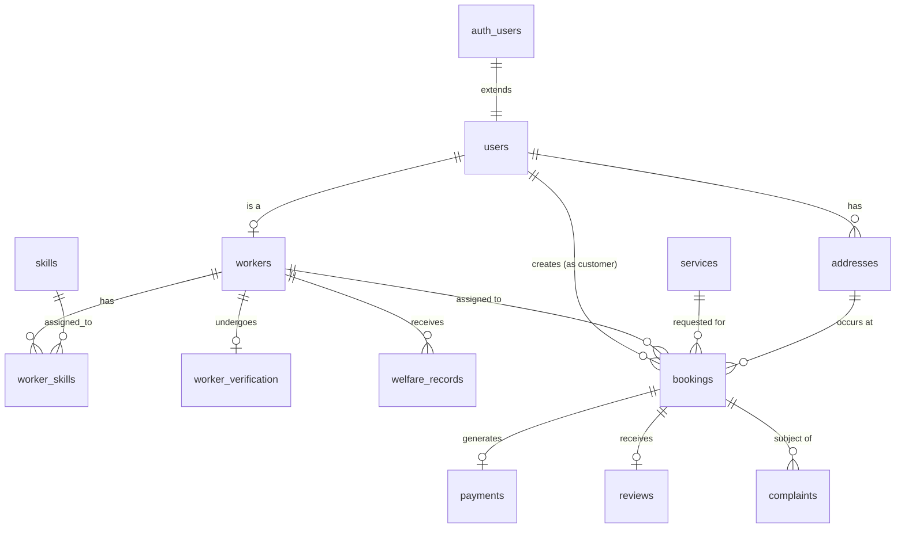

# Database Relationships

## Core Entity Map

## Key Foreign Keys
- `users.id` cascades from `auth.users.id`. When a user is deleted from Supabase Auth, their profile is automatically removed.
- `workers.id` cascades from `users.id`.
- `bookings` holds references to the `customer_id`, `worker_id`, `service_id`, and `address_id`.
- `payments`, `reviews`, and `complaints` all enforce a mandatory `booking_id` relationship. `reviews` enforces a `UNIQUE(booking_id)` constraint so a booking can only be reviewed once.
