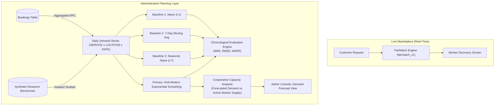

# AI-Based Demand Forecasting for Local Services (`demand_forecast_v1`)
**ShramSetu Research & System Architecture Documentation**

---

## 1. Problem Statement & Research Objective
Gig economy marketplaces frequently suffer from extreme spatial and temporal supply-demand imbalances. In uncoordinated platforms, customer surge demand often triggers unpredictable price gouging, service delays, or artisan burnout. Conversely, for cooperative labour federations, democratic capacity planning requires proactive insight into where and when service requests will peak.

The primary objective of this module is to provide **transparent, mathematically explainable, and reproducible demand forecasting** across local service categories (e.g. Electrical, Plumbing, Carpentry, Cleaning) and geographic zones (e.g. Kothrud, Baner, Bavdhan). This capability empowers the federation administration to anticipate labor shortages, recruit apprentices, and schedule trade certifications without resorting to black-box machine learning or intrusive surveillance.

---

## 2. Architecture & Data Flow Overview

---

## 3. Data Source & Historical Booking Schema
Historical demand is aggregated from the production PostgreSQL `public.bookings` table via the `SECURITY DEFINER` RPC `get_historical_booking_demand`:
- **`scheduled_date` (DATE)**: Primary temporal anchor for demand aggregation.
- **`service_id` (UUID)**: Foreign key to `public.services(id)`.
- **`address_id` / `location_tag`**: Geographic partition (e.g. area name or cluster node).
- **Valid Demand Statuses**: Only `'completed'`, `'inProgress'`, `'accepted'`, and `'pending'` bookings constitute valid realized customer demand.
- **Status Exclusions**: `'rejected'` and `'cancelled'` bookings are excluded from realized demand baselines to prevent skew from user error or duplicate retries.

---

## 4. Dataset Limitations & Synthetic Benchmark Strategy

> [!IMPORTANT]
> **Strict Policy Against Production Data Fabrication**:
> Early-stage pilot deployments have limited historical volume. In adherence to strict scientific ethics, production tables are never polluted with fabricated rows.

To support rigorous research evaluation and reproducible offline benchmarking:
1. **Isolated Benchmark Generator**: A deterministic synthetic benchmark dataset generator creates 60 to 90 days of simulated daily booking records with known trend and weekend seasonality.
2. **Explicit Labeling**: Every benchmark record is stamped with `data_source = 'synthetic_benchmark'` and `is_synthetic = true`.
3. **Admin Visibility**: The Admin UI renders an explicit visual indicator badge (`Synthetic Research Benchmark` vs `Live Marketplace Data`).
4. **Graceful Insufficient Data Fallback**: When live historical volume for a trade/area has fewer than 14 observed days, the system cleanly displays `"Insufficient historical data for reliable forecasting"` rather than hallucinating predictions.

---

## 5. Forecasting Target & Mathematical Formulation
The forecasting target $Y_{s, l, t}$ is defined as the integer count of valid booking requests for service category $s \in S$, in geographic area $l \in L$, on calendar date $t$:

$$Y_{s, l, t} = \sum_{b \in \mathcal{B}} \mathbb{I}\Big(\text{service}(b) = s \land \text{location}(b) = l \land \text{date}(b) = t \land \text{status}(b) \in \mathcal{S}_{\text{valid}}\Big)$$

---

## 6. Time Granularity & Feature Engineering
- **Temporal Granularity**: Daily intervals ($\Delta t = 1\text{ day}$). Hourly forecasting is avoided because it introduces extreme sparsity in local trade clusters without improving cooperative weekly planning.
- **Calendar & Lag Features**:
  - Day-of-week index $d(t) \in \{1, \dots, 7\}$.
  - Weekend indicator $w(t) \in \{0, 1\}$.
  - Lagged observations: $Y_{t-1}, Y_{t-7}, Y_{t-14}$.
  - Rolling mean statistics: $\bar{Y}_{7}(t) = \frac{1}{7} \sum_{i=1}^7 Y_{t-i}$.

---

## 7. Baseline Models

### Baseline 1: Naive Forecast (Persistence)
Tomorrow's demand equals the most recently observed actual demand:
$$\hat{Y}_{t+h} = Y_t$$

### Baseline 2: Moving Average (7-Day Rolling Mean)
Forecast equals the unweighted arithmetic mean of the preceding 7 days:
$$\hat{Y}_{t+h} = \frac{1}{7} \sum_{i=0}^6 Y_{t-i}$$

### Baseline 3: Seasonal Naive (7-Day Lag)
Forecast equals the actual demand from the identical weekday of the preceding week:
$$\hat{Y}_{t+h} = Y_{t+h-7 \cdot \lceil h/7 \rceil}$$

---

## 8. Primary Forecasting Model: Holt-Winters Additive Exponential Smoothing

To capture both local linear trend and weekly cyclical seasonality ($L = 7$), we employ **Holt-Winters Additive Exponential Smoothing**.

### State Equations
For level $l_t$, trend $b_t$, and seasonal component $s_t$:

1. **Level Update**:
   $$l_t = \alpha (Y_t - s_{t-L}) + (1 - \alpha)(l_{t-1} + b_{t-1})$$
2. **Trend Update**:
   $$b_t = \beta (l_t - l_{t-1}) + (1 - \beta) b_{t-1}$$
3. **Seasonal Component Update**:
   $$s_t = \gamma (Y_t - l_t) + (1 - \gamma) s_{t-L}$$

### Forecast Generation
For horizon $h \in \{1, 2, \dots, H\}$:
$$\hat{Y}_{t+h} = \max\Big(0.0, l_t + h \cdot b_t + s_{t+h-L \cdot \lceil h/L \rceil}\Big)$$

### Default Hyperparameters:
- Smoothing parameter $\alpha = 0.30$
- Trend smoothing parameter $\beta = 0.10$
- Seasonal smoothing parameter $\gamma = 0.20$
- Seasonal cycle length $L = 7\text{ days}$

---

## 9. Model Selection Justification
1. **Explainability**: Every component (baseline level, daily growth rate, and weekday cyclical adjustment) is directly interpretable by federation leaders.
2. **Computational Efficiency**: Holt-Winters runs in $\mathcal{O}(N)$ time with minimal memory overhead, requiring zero external Python microservices or heavy C++ binaries.
3. **Small-Sample Robustness**: Deep learning architectures (LSTMs, Transformers) overfit severely on 30–90 day local time series. Holt-Winters provides bounded, stable convergence on small municipal datasets.

---

## 10. Chronological Train/Test Split Strategy
Time-series forecasting cannot use randomized k-fold cross-validation, which causes temporal data leakage. We enforce strict **chronological train/test separation**:
- **Training Window**: First 70% of historical dates.
- **Validation/Burn-in Window**: Intermediate 15% of historical dates.
- **Out-of-Sample Test Window**: Most recent 15% of historical dates (minimum 7 days).
- **Leakage Invariant**: No rolling feature or seasonal index calculated in the test window may access future actual observations.

---

## 11. Configurable Forecast Horizon
- **Default Horizon**: 7 Days (aligned with weekly guild shifts).
- **Extended Horizon**: 14 Days (for bi-weekly apprentice scheduling).
- The horizon parameter is dynamically configurable and never hardcoded in SQL or Dart.

---

## 12. Evaluation Metrics

### Mean Absolute Error (MAE)
$$\text{MAE} = \frac{1}{n} \sum_{t=1}^n |Y_t - \hat{Y}_t|$$

### Root Mean Squared Error (RMSE)
$$\text{RMSE} = \sqrt{\frac{1}{n} \sum_{t=1}^n (Y_t - \hat{Y}_t)^2}$$

### Mean Absolute Percentage Error (MAPE) with Safe Zero Guard
Standard MAPE undefined when $Y_t = 0$. We apply a safe denominator lower bound $\max(Y_t, 1.0)$:
$$\text{MAPE}_{\text{safe}} = \frac{100\%}{n} \sum_{t=1}^n \frac{|Y_t - \hat{Y}_t|}{\max(Y_t, 1.0)}$$

---

## 13. Model Versioning & Traceability
All persistent forecast outputs, evaluation tables, and audit logs are keyed with:
- `model_version`: `'demand_forecast_v1'`
- `generated_at`: ISO 8601 UTC timestamp
- `horizon_days`: Integer horizon length
- `data_source`: `'live'` or `'synthetic_benchmark'`

---

## 14. Database Architecture & Schema
- Table: `public.demand_forecasts` (Migration `014_demand_forecasting.sql`)
- Composite Unique Constraint: `(service_id, location_key, forecast_date, model_version, data_source)`
- RLS Policy: Restricted exclusively to `auth_user_role() = 'ADMIN'`. Normal customers and workers have zero read/write access.

---

## 15. Cooperative Supply-Demand Capacity Planning
Forecasted demand is joined with live verified worker supply in the matching category:

$$\text{Capacity Ratio } R = \frac{N_{\text{active\_workers}}}{\bar{Y}_{\text{daily\_forecast}}}$$

### Deterministic Planning Indicators:
| Capacity Ratio $R$ | Status Indicator | Advisory Action |
| :--- | :--- | :--- |
| $R < 0.60$ | **Potential Supply Deficit** | Notify federation to recruit apprentices or offer weekend overtime shifts |
| $0.60 \le R \le 1.50$ | **Balanced Capacity** | Standard roster; no intervention required |
| $R > 1.50$ | **Capacity Surplus** | Suggest cross-skilling or geographic redeployment |
| Insufficient data | **Insufficient Data** | Defer planning until $\ge 14$ days of history are accumulated |

> [!CAUTION]
> **Advisory-Only Invariant**:
> These indicators are purely advisory. The system will **never** automatically hire, terminate, penalize, or adjust wages for any worker.

---

## 16. Admin UI Integration
The Demand Forecasting interface is embedded directly inside the existing Admin Console (`AdminDemandForecastScreen`, linked from `AdminAnalyticsScreen` and `AdminDashboardScreen`):
- Filter by Trade and Zone.
- Horizon toggles (7D / 14D).
- Native Canvas / CustomPainter trend chart displaying actual vs predicted demand with confidence bounds.
- Metric comparison cards displaying MAE, RMSE, and MAPE across baselines.
- Explicit visual badges denoting data authenticity (`Live Bookings` vs `Synthetic Research Benchmark`).

---

## 17. Security & Privacy Boundaries
- **No Customer PII**: Demand aggregation operates exclusively on counts of bookings by date, service, and area. No names, phone numbers, exact street addresses, or coordinates are exposed.
- **Worker Workload Isolation**: Aggregated supply counts do not disclose individual worker job counts or earnings.
- **Strict Role-Based Security**: Supabase RLS ensures only authenticated users with role `ADMIN` can execute the forecast RPCs or query `demand_forecasts`.

---

## 18. Current Limitations & Future Improvements
1. **Weather & Holiday Exogenous Variables**: Currently, external factors (e.g. monsoon storms, major local holidays) are not modeled. Future versions (`demand_forecast_v2`) may integrate public weather feeds.
2. **Spatial Correlation**: Areas are currently forecasted independently. Spatial autoregression across neighboring Pune pincodes is reserved for future research iterations.
3. **Explicit Confidence Intervals**: Confidence bands are currently estimated via historical residual variance ($\pm 1.96 \cdot \sigma_e$); future work will integrate conformal prediction.
