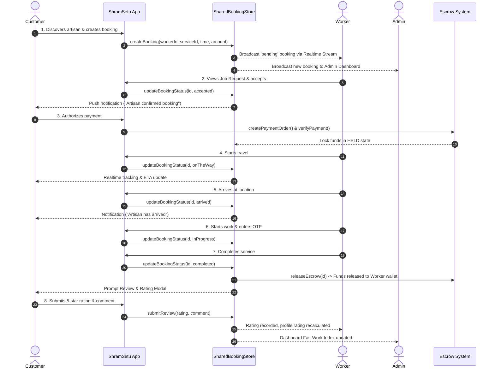

# ShramSetu End-to-End User Journeys & System Flows

## 1. Overview

This document describes the complete, unbroken end-to-end user journeys connecting the **Customer**, **Worker (Artisan Partner)**, and **Cooperative Admin** within ShramSetu.

---

## 2. The Complete 8-Step Service Lifecycle

---

## 3. Journey Details by Role

### 3.1 Customer Journey
1. **Onboarding & Authentication:**
   - Enters mobile number -> receives 6-digit OTP -> enters OTP.
   - Profile check: Existing customer with complete profile goes directly to `/customer/home`. New customer completes quick onboarding (Name, Address) and proceeds.
2. **Discovery & Matching:**
   - Explores categories (Plumbing, Electrical, Cleaning, Carpentry).
   - FairMatch v1 ranks artisans using explainable criteria (Proximity, Fair Work Distribution, Skill Badge, Coop Rating).
   - Customer selects artisan and chooses date & time.
3. **Tracking & Service Experience:**
   - Live stream updates as artisan status advances: `accepted` $\to$ `onTheWay` $\to$ `arrived` $\to$ `inProgress` $\to$ `completed`.
   - Customer provides arrival OTP to verify physical arrival.
4. **Completion & Feedback:**
   - Once completed, customer rates artisan (1 to 5 stars) with optional feedback.

### 3.2 Worker (Artisan Partner) Journey
1. **Authentication & Shift Toggle:**
   - Logs in with phone and OTP.
   - Toggles availability status (Online / Offline).
2. **Job Request Reception:**
   - Real-time stream receives new job request with customer location, tariff breakdown, and distance.
   - Accepts request.
3. **Service Execution:**
   - Updates status: `onTheWay` $\to$ `arrived` $\to$ `inProgress` $\to$ `completed`.
4. **Guaranteed Payout:**
   - Completion immediately releases escrow funds into the worker's earnings wallet without administrative delays.

### 3.3 Admin Journey
1. **Coop Hub Dashboard:**
   - Observes platform health: active bookings, verified artisans, escrow pool locked, cooperative welfare fund balance.
2. **Bookings Oversight:**
   - Real-time monitor of all marketplace bookings across Pune district.
3. **Verification & Moderation:**
   - Reviews worker KYC documents, approves/rejects credentials.
   - Moderates reviews and resolves customer complaints.
