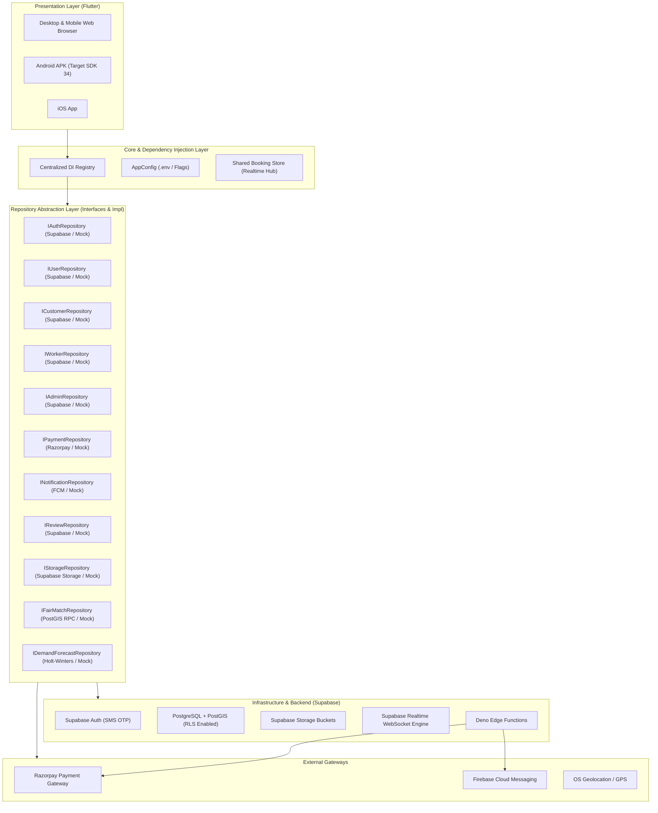

# ShramSetu — System Architecture & Integration Specification

## 1. System Overview

**ShramSetu (श्रमसेतू)** is an AI-powered cooperative gig worker service marketplace connecting urban Indian customers with verified trade artisans (karigars) across home maintenance trades (plumbing, electrical, carpentry, appliance repair, cleaning).

The architecture is built on five core principles:
1. **Cooperative-First Economics:** 0% middleman commission; transparent pricing with trade union backing and welfare fund allocation.
2. **Explainable AI Matching (FairMatch v1):** Multi-objective, deterministic worker matching that balances trade skills, proximity, performance ratings, and workload distribution to prevent gig worker burnout and monopoly.
3. **Cooperative Escrow & Trust:** Payments are reserved in an escrow contract and only disbursed to the worker's bank/UPI account upon two-party satisfaction verified via a customer sign-off OTP.
4. **First-Class Cross-Platform Deployment:** Runs with parity across Android, iOS, and Modern Desktop/Mobile Web browsers.
5. **Decoupled Service-Oriented Clean Architecture:** Strict separation between Presentation (Stitch-derived UI tokens), Business Domain, Repository Layer, and Infrastructure (Supabase, Razorpay, FCM, Geolocation).

---

## 2. Global Architecture Diagram

---

## 3. Detailed Subsystem Specifications

### 3.1 Customer Flow
- **Entry & Location:** Customer enters via Splash/Home -> Address is resolved via GPS reverse geocoding or interactive map picker.
- **Discovery:** Customer selects a trade category -> `customerRepo.getEligibleWorkers` invokes `FairMatchService` to fetch explainably ranked workers.
- **Scheduling:** Customer selects date slot and time slot -> Reviews transparent rate breakdown (base rate + 3% union cess + 18% GST).
- **Checkout & Escrow:** Booking is created with status `pending`. Razorpay payment order is generated (or web simulation) and verified server-side. Escrow funds are marked `held`.
- **Realtime Tracking:** Customer enters `CustomerLiveTrackingScreen` watching live status changes (`accepted` -> `onTheWay` -> `arrived` -> `inProgress` -> `completed`).
- **Completion & Escrow Release:** Once worker completes the job and customer verifies the completion OTP, escrow funds are automatically released to the worker.
- **Review & Rating:** Completion prompts the `ReviewRatingModal` where customer rates the worker (1–5 stars) and submits feedback to the federation.

### 3.2 Worker Flow
- **Registration & KYC:** Worker registers trade skills, personal details, government ITI certs, and identity documents uploaded to `worker-documents` storage bucket.
- **Dashboard & Dispatch:** Worker toggles availability (`isAvailable`). Incoming customer bookings stream directly into `WorkerJobRequestsScreen` via real-time subscription.
- **Acceptance & Execution Lifecycle:** Worker accepts job -> Advances through canonical state machine:
  1. `pending` / `accepted` -> Worker taps "Start Journey" -> moves to `onTheWay`.
  2. `onTheWay` -> Worker taps "Mark Arrived" -> moves to `arrived`.
  3. `arrived` -> Worker taps "Start Work" -> moves to `inProgress`.
  4. `inProgress` -> Worker inputs customer's 4-digit completion OTP -> moves to `completed`.
- **Earnings & Welfare:** Upon job completion and escrow release, worker earnings reflect the payout immediately in `WorkerEarningsScreen`.

### 3.3 Admin Flow
- **Cooperative Federation Hub:** Admins log in at `/login/admin` (role strictly verified as `ADMIN`).
- **Verification & Governance:** Review pending worker KYC verifications and approve/reject credentials.
- **Operations & Bookings:** View live booking feeds across all Pune wards; intervene in disputes; forcefully reassign or cancel if necessary.
- **Financial Auditing:** Track total escrow throughput, platform commission (0%), union welfare reserves, and dispute refunds.
- **AI Analytics & Capacity Planning:** Inspect FairMatch workload distribution metrics and run Holt-Winters trade demand forecasting to dispatch mobile union units to high-demand clusters.

### 3.4 Authentication & Route Protection Flow
- **Multi-Role User Schema:** Every authenticated user row in `users` has a strict `role` (`CUSTOMER`, `WORKER`, `ADMIN`).
- **Authorization Enforcement:** Protected routes are guarded at the application root:
  - `/customer/*` requires authenticated `CUSTOMER` role.
  - `/worker/*` requires authenticated `WORKER` role.
  - `/admin/*` requires authenticated `ADMIN` role.
- **Unauthorized Navigation Fallback:** Attempted navigation to unauthorized roles or unauthenticated deep links immediately redirects the user to the corresponding role login screen without exposing private views.

### 3.5 Booking State Machine Flow
Canonical state transitions enforced across Dart models, Supabase RLS, and repository layers:

| Current State | Permitted Next States | Terminal State? | Initiator |
|---|---|---|---|
| `pending` | `accepted`, `rejected`, `cancelled` | No | Worker (Accept/Reject) / Customer (Cancel) |
| `accepted` | `onTheWay`, `cancelled` | No | Worker / Customer (Cancel before departure) |
| `onTheWay` | `arrived` | No | Worker |
| `arrived` | `inProgress` | No | Worker |
| `inProgress` | `completed` | No | Worker (requires Customer OTP) |
| `completed` | *None* | **Yes** | Terminal state (triggers Escrow release) |
| `rejected` | *None* | **Yes** | Terminal state |
| `cancelled` | *None* | **Yes** | Terminal state (triggers refund) |

### 3.6 Payment & Escrow Flow
- **Order Creation:** `createPaymentOrder(bookingId)` calls Supabase Edge Function `create-payment-order`, generating a Razorpay Order ID.
- **Escrow Holding:** On client payment success, `verifyPayment(...)` invokes `verify-payment` Edge Function to cryptographically verify signature with Razorpay Secret. Funds state updates to `held`.
- **Escrow Release:** When the booking transitions to `completed`, `releaseEscrow(bookingId)` calls `release-escrow` Edge Function, releasing payout to the worker's registered UPI/VPA.

### 3.7 Realtime Synchronization Flow
- **Supabase Mode:** `BookingRealtimeService` subscribes to PostgreSQL CDC (`supabase.channel('bookings')`) filtered by user role or booking ID.
- **Mock/Demo Mode:** `SharedBookingStore` maintains a reactive broadcast stream (`StreamController<List<UnifiedBooking>>.broadcast()`). Mutations by Customer or Worker propagate instantly to all active subscribers across screens without manual page reload.

### 3.8 Notification Flow
- Handled by `NotificationService` (FCM) and `INotificationRepository`.
- Device tokens are registered upon login (`registerDeviceToken(userId)`).
- Triggers push notifications on critical lifecycle events:
  - `booking_requested`: Notifies worker of incoming booking.
  - `booking_status`: Notifies customer of worker transit, arrival, and completion.
  - `escrow_released`: Notifies worker of deposited payment.

### 3.9 Location Flow
- **Mobile:** Geolocator platform plugin captures GPS latitude/longitude.
- **Web:** Browser HTML5 Geolocation API with native permission prompt.
- **Distance Calculation:** Haversine formula implemented in `DistanceCalculator.haversineDistanceKm`.
- **Graceful Fallback:** If location is denied or unavailable, defaults smoothly to Pune city center (18.5204° N, 73.8567° E) with clear manual address input options.

### 3.10 FairMatch Flow
- **Inputs:** Service Trade ID, Customer Coordinates, Worker Proximity, Worker Historical Rating, Experience Years, Completed Job Count, Current Day Workload.
- **Scoring Function:** Deterministic multi-objective composite score:
  $$\text{Score} = w_1 \cdot \text{Proximity} + w_2 \cdot \text{Rating} + w_3 \cdot \text{Experience} + w_4 \cdot \text{WorkloadFairness}$$
- **Customer Explainability:** Generates transparent explanation badges ("Near your area", "High customer satisfaction", "FairMatch Recommended") without leaking private competitor metric values.

### 3.11 Demand Forecasting Flow
- **Algorithm:** Triple Exponential Smoothing (Holt-Winters) handling level, trend, and seasonal weekly cycles.
- **Inputs:** Aggregated historical booking counts grouped by trade category and municipal ward over 30-day windows.
- **Outputs:** Projected demand over 7-day and 14-day horizons, recommended artisan staffing levels, and model evaluation metrics (MAPE, RMSE, MAE).

### 3.12 Review & Rating Flow
- Handled by `IReviewRepository`.
- Customer submits a 1–5 star rating with trade-specific tags (punctuality, craft quality, cleanliness, fair pricing) upon service completion.
- Submissions recalculate the worker's cumulative average rating and increment total review count in PostgreSQL.

### 3.13 Storage & KYC Flow
- Files uploaded using `IStorageRepository.uploadFile` with platform-agnostic byte payloads (`Uint8List`).
- Buckets:
  - `profile-images`: Public read, authenticated user write.
  - `worker-documents`: Restricted RLS read (worker owner & admin only).

### 3.14 Web Architecture
- Fully compatible with modern evergreen desktop and mobile browsers (Chrome, Firefox, Safari, Edge).
- Tree-shaken Web CanvasKit & HTML renderer support.
- Base href configured for GitHub Pages (`/ShramSetu/`) and custom domains.
- Responsive layout adapts wide desktop screens (`width >= 800`) with persistent sidebar / navigation rail while maintaining mobile bottom navigation on phone viewports.
- Deep linking and SPA client routing supported via `404.html` and `.nojekyll`.

### 3.15 Mobile Architecture
- Compiled to native Android ARM64/ARM32 APK / AAB.
- Standard Material 3 theming with Urban Company Polish design tokens.
- Native Android permissions handled for Fine/Coarse Location and Storage/Photo picker.

### 3.16 Error & Fallback Architecture
- All network and repository interactions include defensive `.timeout()` guards (3–6 seconds) to guarantee UI threads never freeze or hang indefinitely.
- Comprehensive `try ... catch ... finally` blocks ensure UI loading flags (`_isLoading`, `_isSaving`, `_isSubmitting`) always cleanly reset.
- Empty states, loading spinners, and error snackbars exist across all major views.
